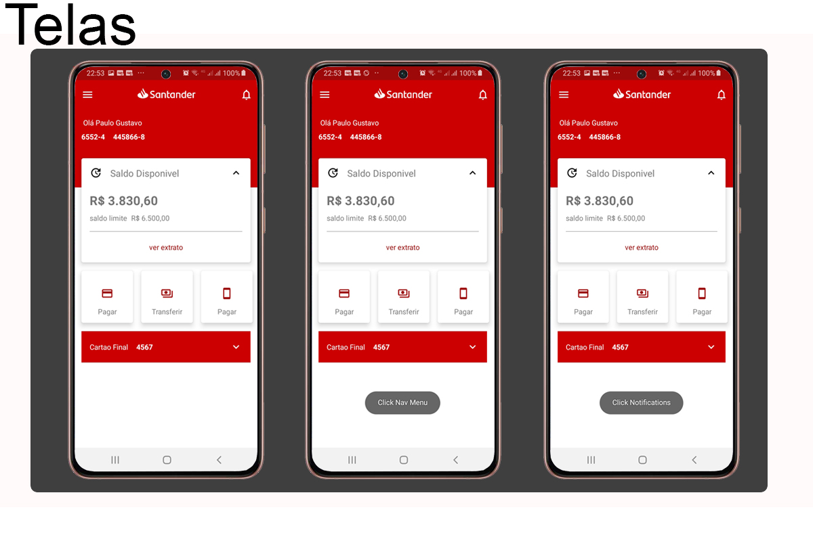

# SantaderDevWeek com Kotlin 

Esta semana acompanhei o #SantanderDevWeek desenvolvendo um  clone da tela principal do app do Santander com finalidade de aprimorar conhecimentos adquiridos em Kotlin. Apos finalizar o   BootCAmp da  Everis na DIO.

 E já no aquecimento para o Santander Bootcamp | Mobile Developer  

Fiquem a vontade para olhar estou aberto  a dicas e sugestões.

